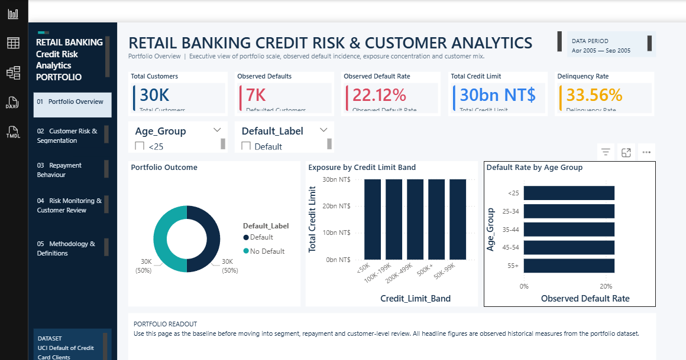
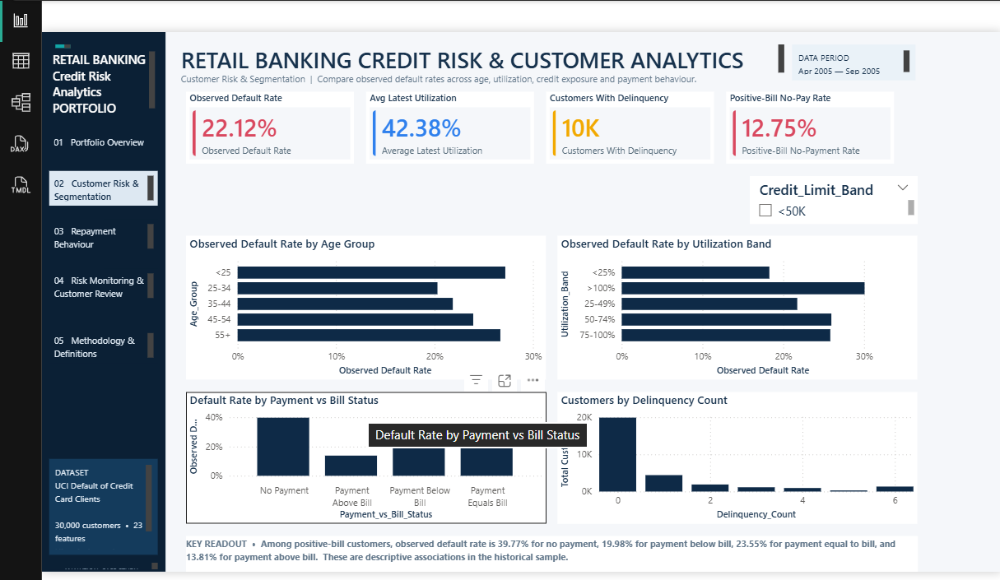
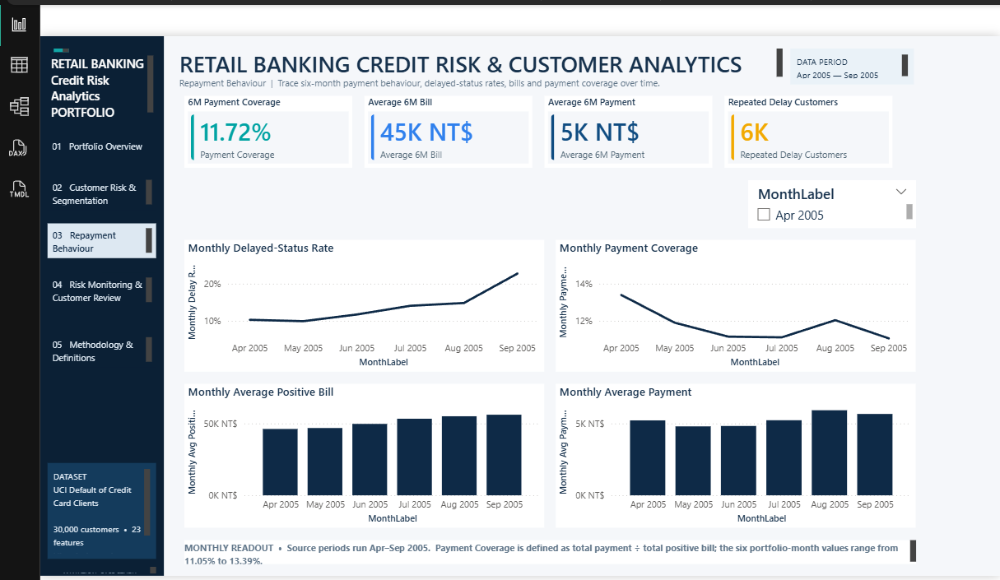
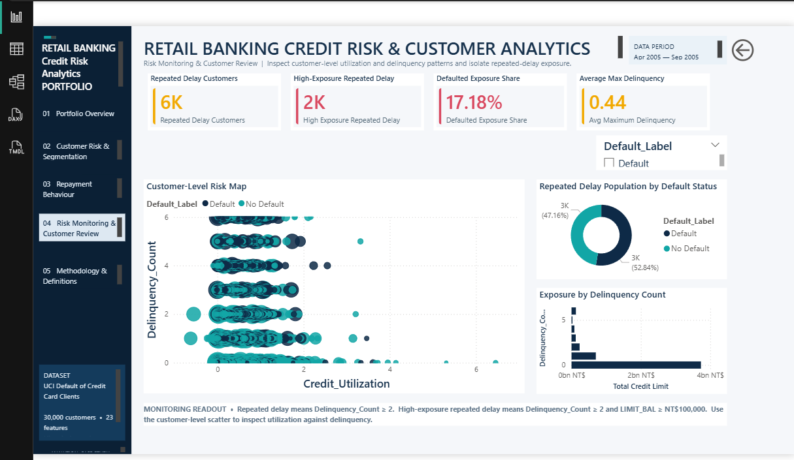

# Retail Banking Credit Risk & Customer Analytics

**End-to-end Data Analyst portfolio project** using **Excel, Python, MySQL, and Power BI** to analyze a historical retail credit-card portfolio, validate analytical outputs across tools, and translate repayment behavior into business-monitoring insights.

## Executive summary

This project examines **30,000 credit-card customers** to understand:

- observed default risk and delinquency
- credit exposure and customer segments
- repayment behavior and payment stress
- portfolio-level monitoring indicators
- how the same analytical definitions reconcile across Excel, Python, SQL, and Power BI

> **Important:** This is an analysis of historical public credit-card data. The findings describe observed patterns in the case-study population and are **not** a live lending, credit-approval, or automated collections decision system.

## Business problem

A retail banking analytics team wants a consistent view of portfolio risk and customer repayment behavior.

The analysis is designed to answer questions such as:

1. How large is the observed default and delinquency population?
2. Where is credit exposure concentrated?
3. Which customer groups show different observed repayment patterns?
4. How common are positive-bill customers with no recorded payment?
5. What portfolio KPIs can be monitored consistently across analytical tools?

## Key portfolio findings

| KPI | Verified value |
|---|---:|
| Customers | **30,000** |
| Observed defaults | **6,636** |
| Observed default rate | **22.12%** |
| Total credit limit | **NT$5.02B** |
| Average credit limit | **NT$167,484** |
| Customers with delinquency | **10,069** |
| Delinquency rate | **33.56%** |
| Positive-bill customers | **27,402** |
| Positive-bill / no-payment customers | **3,495** |
| Positive-bill / no-payment rate | **12.75%** |
| Six-period portfolio Payment Coverage | **11.72%** |

### What the analysis shows

**Default and delinquency are different monitoring signals.**  
The observed default population is 6,636 customers, while 10,069 customers show delinquency across the six observed repayment-status periods.

**A measurable repayment-stress segment exists.**  
3,495 customers have a positive bill but no recorded payment, representing 12.75% of customers with positive bills.

**Credit exposure is substantial.**  
The portfolio contains approximately NT$5.02B in total credit limit across 30,000 customers.

**Portfolio Payment Coverage provides a complementary monitoring KPI.**  
Across the six observed periods, total recorded payments represent 11.72% of total positive billed amounts under the project definition.

These figures are descriptive portfolio statistics; they should not be interpreted as causal effects or future default probabilities.

## Dashboard preview

### Portfolio overview



### Customer risk & segmentation



### Repayment behaviour



### Risk monitoring & customer review



## Business use of the analysis

The outputs can support analytical and monitoring workflows such as:

- identifying customer segments with different repayment behavior
- monitoring delinquency and payment-stress populations
- examining concentration of credit exposure
- tracking portfolio-level repayment coverage
- comparing risk indicators across age, education, marital-status, and credit-limit segments

The analysis deliberately keeps these uses separate from automated lending decisions.

## End-to-end architecture

```text
                 Historical UCI source data
                         (25 fields)
                              |
              +---------------+---------------+
              |                               |
         Excel audit                     Python EDA
       + KPI / pivots               + feature engineering
              |                         + validation
              |                               |
              +---------------+---------------+
                              |
                Standardized analytical CSV
                         (43 fields)
                              |
                 +------------+------------+
                 |                         |
             MySQL branch             Power BI branch
          schema + QA + SQL          Power Query + DAX
        analytical objects +         semantic model +
          business analysis             dashboard
                 |                         |
                 +------------+------------+
                              |
                   Cross-tool controls
                       reconcile outputs
```

The project is intentionally a **branching analytical pipeline** rather than a claim that Power BI consumes the MySQL database directly.

## What each tool contributes

| Tool | Contribution |
|---|---|
| **Excel** | Source audit, formulas, KPI validation, pivots and business-facing analysis |
| **Python** | EDA, feature engineering, reproducible calculations and control-total validation |
| **MySQL** | Schema design, QA checks, analytical objects, business queries and validation |
| **Power BI** | Power Query transformations, semantic model, DAX measures and interactive reporting |

## Project structure

| Folder | Purpose |
|---|---|
| [data/raw](data/raw/) | Bundled source CSV |
| [data/cleaned](data/cleaned/) | Standardized analytical CSV |
| [excel](excel/) | Validated Excel analysis workbook |
| [python](python/) | Reproducible Python analysis notebook |
| [sql](sql/) | Modular SQL scripts and master workbook |
| [powerbi](powerbi/) | PBIP/PBIR project, semantic model and DAX documentation |
| [documentation](documentation/) | Controls, audit notes and setup instructions |
| [Screenshots](Screenshots/) | Dashboard and analysis previews |
| [tools](tools/) | One-time local path configuration utility |

## Reproducibility

### 1. Clone the repository

```bash
git clone https://github.com/HARIGIT29/banking-credit-risk-analytics.git
cd banking-credit-risk-analytics
```

### 2. Configure local paths

Run:

```powershell
./tools/CONFIGURE_LOCAL_PATHS.ps1
```

This creates machine-specific SQL files locally and configures the Power BI project-root parameter without placing a personal Windows path in the public templates.

### 3. Python

Open:

[python/Retail_Banking_Credit_Risk_Python_Analysis.ipynb](python/Retail_Banking_Credit_Risk_Python_Analysis.ipynb)

The notebook discovers the bundled data, performs feature engineering, runs EDA, and validates the release control totals.

### 4. MySQL

Use the documented sequence in [sql/README_SQL.md](sql/README_SQL.md):

```text
01_schema.sql
    |
02_load_dataset.sql
    |
03_qa_checks.sql
    |
04_analytical_objects.sql
    |
05_business_analysis.sql
    |
06_monthly_behavior.sql
    |
07_customer_review.sql
    |
08_validation.sql
```

### 5. Power BI

Open:

[powerbi/Retail_Banking_Credit_Risk_Analytics.pbip](powerbi/Retail_Banking_Credit_Risk_Analytics.pbip)

See [powerbi/START_HERE.md](powerbi/START_HERE.md) for the project-specific opening and refresh steps.

## Analytical definitions

**Observed default:** the dataset's supplied default label/target.

**Delinquency:** at least one positive repayment-status code across the six observed periods.

**Positive bill:** bill amount greater than zero for the relevant period.

**Portfolio Payment Coverage:** total recorded payments divided by total positive bills across the six observed periods.

**Latest Credit Utilization proxy:** `BILL_AMT1 / LIMIT_BAL`. Non-positive latest bills remain in the raw proxy calculation and therefore fall into the `<25%` band; they are not interpreted as positive utilization.

**Latest Payment-vs-Bill Status:** for positive bills, customers are classified as negative payment, no payment, payment below bill, payment equal to bill, or payment above bill. The current dataset contains no negative payments.

## Cross-tool validation

The project includes a shared control file:

[documentation/CROSS_TOOL_CONTROL_TOTALS.csv](documentation/CROSS_TOOL_CONTROL_TOTALS.csv)

The same headline metrics were independently reconciled across the analytical branches. The audit documentation records the tested definitions and remaining runtime considerations.

See:

- [documentation/FINAL_AUDIT_REPORT.md](documentation/FINAL_AUDIT_REPORT.md)
- [documentation/FINAL_RELEASE_CHECKLIST.md](documentation/FINAL_RELEASE_CHECKLIST.md)
- [documentation/PYTHON_EXECUTION_VERIFICATION.md](documentation/PYTHON_EXECUTION_VERIFICATION.md)
- [documentation/LOCAL_SETUP.md](documentation/LOCAL_SETUP.md)

## Dataset and limitations

The project uses historical public credit-card data from the UCI Default of Credit Card Clients dataset.

Important limitations:

- the data represents a historical case-study population, not a live bank portfolio
- relationships in the data are observational and should not be interpreted as causal
- results should not be generalized automatically to other banks, countries, or time periods
- the project is intended for analytics, monitoring, and portfolio exploration rather than automated lending decisions

## Portfolio value

This project demonstrates an end-to-end analyst workflow:

**business problem → data audit → feature engineering → SQL analysis → KPI validation → dashboarding → cross-tool reconciliation → business interpretation**

The emphasis is not only on producing charts, but on making analytical definitions explicit and ensuring that the numbers used in Excel, Python, SQL, and Power BI reconcile.

---

### Author

**Hari Narayana**  
GitHub: [HARIGIT29](https://github.com/HARIGIT29)
